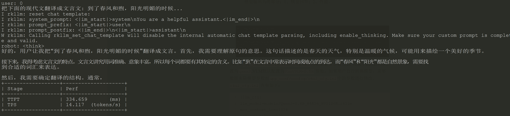
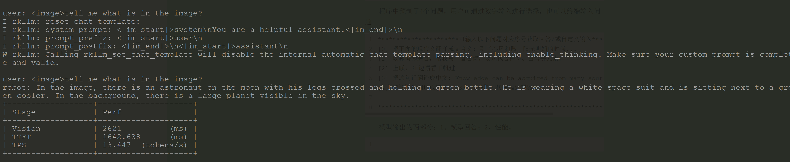

# RKAI 开发指南

文件标识：RK-KF-YF-A61

发布版本：V1.0.0

日期：2025-09-30

文件密级：□绝密   □秘密   □内部资料   ■公开

**免责声明**

本文档按“现状”提供，瑞芯微电子股份有限公司（“本公司”，下同）不对本文档的任何陈述、信息和内容的准确性、可靠性、完整性、适销性、特定目的性和非侵权性提供任何明示或暗示的声明或保证。本文档仅作为使用指导的参考。

由于产品版本升级或其他原因，本文档将可能在未经任何通知的情况下，不定期进行更新或修改。

**商标声明**

“Rockchip”、“瑞芯微”、“瑞芯”均为本公司的注册商标，归本公司所有。

本文档可能提及的其他所有注册商标或商标，由其各自拥有者所有。

**版权所有 © 2025 瑞芯微电子股份有限公司**

超越合理使用范畴，非经本公司书面许可，任何单位和个人不得擅自摘抄、复制本文档内容的部分或全部，并不得以任何形式传播。

瑞芯微电子股份有限公司

Rockchip Electronics Co., Ltd.

地址：     福建省福州市铜盘路软件园A区18号

网址：     [www.rock-chips.com](http://www.rock-chips.com)

客户服务电话： +86-4007-700-590

客户服务传真： +86-591-83951833

客户服务邮箱： [fae@rock-chips.com](mailto:fae@rock-chips.com)

---

**前言**

**概述**

本文为大语言模型和视觉类大模型的快速验证和开发指南。

**产品版本**

| **芯片名称** | **内核版本** |
| ------------ | ------------ |
| RV1126B      | Kernel 6.1   |

**读者对象**

本文档（本指南）主要适用于以下工程师：

技术支持工程师

软件开发工程师

**修订记录**

| **版本号** | **作者**    | **修改日期** | **修改说明** |
| ---------- | ----------- | ------------ | ------------ |
| V1.0.0     | Cherry Chen | 2025-09-30   | 初始版本     |

---

**目录**

[TOC]

---

## 简介

RKAI模块为SDK集成使用大语言模型（Large Language Model, LLM）和视觉类大模型（以下简称：Vision Language Model, VLM）的快速验证模块和适配示例，本模块代码开源，源码路径：`app/rkai`，目录结构为：

```SHELL
tree  rkai -L 1
rkai
├── app_conf #配置文件和模型文件
├── CMakeLists.txt
├── common  #通用代码
├── LICENSE
├── README.md
├── rkai_LLM  # LLM模型API源码
├── rkai_VLM  # VLM模型API源码
└── samples   # 适配用例

5 directories, 3 files
```

- app_conf为通用配置路径，该路径包括模型文件，模型配置文件，模型输入文件三个部分组成，该部分可以直接集成到板端以供使用。
- common为RKAI模块通用代码，例如`CNPY` 等；
- rkai_LLM为LLM部署通用API；
- rkai_VLM为VLM部署通用API；
- samples提供LLM/Vision/VLM三个验证用例。

## 快速验证

SDK默认自动编译了RKAI模块，且集成`Qwen3-0.6B`模型，供用户快速验证大模型流程。

### LLM快速验证

LLM适配程序为`rkai_LLM_Demo`，Usge如下：

```shell
Usage: rkai_LLM_Demo [options]
Options:
  --llm_model <path>   RKLLM model file
  --config    <path>   Configuration ini file
Example:
  rkai_LLM_Demo --llm_model /usr/share/app_config/models/Qwen3-0.6B_W4A16_RV1126B.rkllm \
  --config rkai_config.ini
```

默认推理命令：

```shell
rkai_LLM_Demo --config rkai_config.ini
```

程序中预制了4个问题，用户可通过数字输入进行选择，也可以终端输入问题。

```shell
**********************可输入以下问题对应序号获取回答/或自定义输入********************
[0] 把下面的现代文翻译成文言文: 到了春风和煦，阳光明媚的时候...
[1] 以咏梅为题目，帮我写一首古诗，要求包含梅花、白雪等元素。
[2] 上联: 江边惯看千帆过
[3] 把这句话翻译成中文: Knowledge can be acquired from many sources...
[4] 把这句话翻译成英文: RK3588是新一代高端处理器...

*************************************************************************
```

 模型输出为两部分：1、模型回答；2、性能。



也可以自己转换模型后，使用`rkai_LLM_Demo`进行模型推理验证。详细说明见第三部分。

### VLM快速验证

 VLM实则为Vision和LLM，可以分开验证，也可以一起进行验证，由于模型内存占用大，不方便集成到SDK中。因此，用户快速验证VLM模型可以从以下网址进行模型下载。

 Vision模型下载链接为：<https://www.modelscope.cn/models/eliasning/Qwen3-0.6B-w4a16.rv1126b.rkllm/resolve/master/fastvlm-0.5b-fp16.rv1126b.rknn>；

 LLM下载链接为： <https://www.modelscope.cn/models/eliasning/Qwen3-0.6B-w4a16.rv1126b.rkllm/resolve/master/fastvlm-0.5B-w8a8_level0.rv1126b.rkllm>。

 将下载的模型push到板端`app_cofig/models` 目录中。然后可以使用`raki_VLM_Demo`进行快速验证。`Usage`如下：

```shell
Usage: rkai_VLM_Demo [options]
Options:
  --vision_model <path>   Vision RKNN model file
  --llm_model    <path>   LLM RKLLM model file
  --image_path   <path>   Input image file
  --config       <path>   Configuration ini file
Example:
  ./rkai_VLM_Demo --vision_model fastvlm-0.5b-fp16.rv1126b.rknn  \
  	               --llm_model fastvlm-0.5B-w8a8_level0.rv1126b.rkllm \
  	               --image_path image.jpg --config rkai_config.ini \
```

如果将下载的模型推到`app_conf/models`路径下，则可以使用以下命令推理：

```shell
rkai_VLM_Demo --config rkai_config.ini
```

如果下载的模型推到其他路径下，则需要手动指定：

```shell
rkai_VLM_Demo --vision_model xxx.rknn  \
			  --llm_model xxx.rkllm     \
	          --config rkai_cfg.ini
```

模型输出为两部分：1、模型回答；2、性能。



## 自定义模型

用户可以自行转换模型，通过`rkai_LLM_Demo` 和`rkai_VLM_Demo` 进行推理。模型转换工具下载链接：https://github.com/airockchip/rknn-llm。如果用户自定义模型，那么`rkai_cfg.ini`需要进行对应修改。

1. `rkai_cfg.ini` 中[llm_cfg]为LLM参数，包含模型超参数，用户可以通过调节参数来调整模型。参数如下：

| 参数               | 默认值                                | 说明                            |
| ------------------ | ------------------------------------- | ------------------------------- |
| llm_model          | models/Qwen3-0.6B_W4A16_RV1126B.rkllm | 可以通过外部参`--llm_model`定义 |
| max_context_len    | 1024                                  | 最长上下文                      |
| max_new_tokens     | 128                                   | 最长输出tokens                  |
| skip_special_token | 1                                     | 是否跳过特殊字符                |
| base_domain_id     | 0                                     | 内存使用方式，默认为0           |
| top_k              | 1                                     | 小于等于1                       |

2. `rkai_cfg.ini` 中[vlm_cfg]为VLM参数，包含模型超参数，用户可以通过调节参数来调整模型。参数如下:

| 参数               | 默认值                                        | 说明                                   |
| ------------------ | --------------------------------------------- | -------------------------------------- |
| vision_model       | models/fastvlm-0.5b-fp16.rv1126b.rknn         | 也可以通过外部参`--vision_model`定义   |
| llm_model          | models/fastvlm-0.5B-w8a8_level0.rv1126b.rkllm | 可以通过外部参`--llm_model`定义        |
| image_path         | inputs/image_1024x1204.npy                    | 支持输入jpg图片，通过`–image_path`指定 |
| max_context_len    | 512                                           | 最长上下文                             |
| skip_special_token | 1                                             | 是否跳过特殊字符                       |
| base_domain_id     | 0                                             | 内存使用方式，默认为0                  |
| top_k              | 1                                             | 小于等于1                              |

3. `rkai_cfg.ini` 中[prompt]为系统prompt，用户自定义模型，这部分需要修改。参数如下：

| 参数           | 默认值                                                       | 说明                         |
| -------------- | ------------------------------------------------------------ | ---------------------------- |
| system_prompt  | <\|im_start\|>system\nYou are a helpful assistant.<\|im_end\|>\n | 默认为qwen3的系统prompt      |
| prompt_prefix  | <\|im_start\|>user\n                                         | 通过模型的config文件可以获取 |
| prompt_postfix | <\|im_end\|>\n<\|im_start\|>assistant\n                      | 通过模型的config文件可以获取 |

4. `rkai_cfg.ini` 中[tensor]为VLM模型的图像占位符，用户自定义模型，这部分需要修改。参数如下：

   | 参数        | 默认值           | 说明                               |
   | ----------- | ---------------- | ---------------------------------- |
   | img_start   | <\|im_start\|>   | 图片占位符，可以在模型config中获取 |
   | img_end     | <\|im_end\|>     | 同上                               |
   | img_content | <\|im_content\|> | 同上                               |

## API详细说明

用户可以自行调用API进行应用集成，API全开源，以下是API说明。

### LLM API

对LLM模型进行初始化和反初始化的API如下：

| API  | rkai_llm_init             |
| ---- | ------------------------- |
| 描述 | LLM初始化                 |
| 参数 | rkaiCtxLLM* ctx： LLM句柄 |
|      | rkaiCfg* cfg :LLM参数配置 |

| API  | rkai_llm_release |
| ---- | ---------------- |
| 描述 | LLM返初始化      |

对LLM推理部署的API如下：

| API  | rkai_llm_run              |
| ---- | ------------------------- |
| 描述 | LLM推理                   |
| 参数 | rkaiCtxLLM* ctx： LLM句柄 |
|      | rkaiCfg* cfg :LLM参数配置 |

### VLM API

VLM的Vision模型API：

| API  | rkai_vlm_vision_init                                |
| ---- | --------------------------------------------------- |
| 描述 | Vision初始化                                        |
| 参数 | const char *model_path：vision模型路径，为.rknn模型 |
|      | rkaiCfg* cfg :LLM参数配置                           |

| API  | rkai_vlm_vision_release |
| ---- | ----------------------- |
| 描述 | Vision返初始化          |

对Vision推理的API如下：

| API  | rkai_vlm_vision_run                                  |
| ---- | ---------------------------------------------------- |
| 描述 | LLM推理                                              |
| 参数 | rkaiCtxVision *rkai_ctx： 句柄                       |
|      | void *img_data: 输入图片buffer，为rgb888             |
|      | rkaiVisionToLLM *vtol： vision to llm 参数以及buffer |

| API  | dump_tensor_attr                        |
| ---- | --------------------------------------- |
| 描述 | dump模型的基本信息                      |
| 参数 | rknn_tensor_attr *attr： 模型tensor信息 |
|      | int32_t is_inputs： 是否dump输入        |

VLM的LLM API：

| API  | rkai_vlm_llm_init         |
| ---- | ------------------------- |
| 描述 | LLM初始化                 |
| 参数 | rkaiCtxLLM* ctx： LLM句柄 |
|      | rkaiCfg* cfg :LLM参数配置 |

| API  | rkai_vlm_llm_release |
| ---- | -------------------- |
| 描述 | LLM返初始化          |

对LLM推理部署的API如下：

| API  | rkai_vlm_llm_run                         |
| ---- | ---------------------------------------- |
| 描述 | LLM推理                                  |
| 参数 | rkaiCtxLLM* ctx： LLM句柄                |
|      | rkaiCfg* cfg :LLM参数配置                |
|      | rkaiVisionToLLM *vtl:接收Vison过来的信息 |